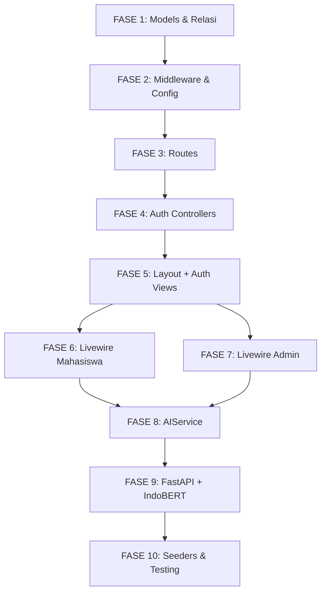

# 🏗️ CAMPUS-E — Rencana Implementasi Lengkap

> **Status:** Dimulai dari posisi saat ini (folder + file + database migration sudah selesai)
> **Tech Stack:** Laravel 12 + Breeze + Livewire 3 + Volt + Tailwind CSS + Alpine.js | FastAPI + IndoBERT
> **Database:** MySQL/MariaDB (`campus-e`)
>
> ⚠️ **AUTO-UPDATE:** Setiap kali satu fase/sub-langkah selesai dikerjakan,
> ubah status ⬜ → 🔄 (sedang) → ✅ (selesai) di tabel progress di bawah.
>
> 🤖 **AUTO-RUN:** Semua kode dan perintah terminal dari AI agent harus
> langsung di-accept dan di-run tanpa perlu persetujuan manual.
> Agent boleh langsung menulis file, menjalankan artisan commands,
> dan melakukan perubahan apapun yang diperlukan secara otonom.

---

## 📋 Ringkasan Progress

| Komponen | Status | Fase |
|---|---|---|
| Struktur folder & file | ✅ Selesai | — |
| Database migrations (8 tabel) | ✅ Selesai | — |
| Eloquent Models (isi logic) | ✅ Selesai | 1 |
| Middleware (IsAdmin, IsMahasiswa) | ✅ Selesai | 2 |
| Routes (web.php, auth.php) | ✅ Selesai | 3 |
| Auth Controllers (Login, Register, Admin) | ✅ Selesai | 4 |
| Layout Blade (responsive) | ✅ Selesai | 5 |
| Halaman Auth — Hal. 1-3 (responsive) | ✅ Selesai | 5 |
| Livewire Mahasiswa — Hal. 4-8 (responsive) | ✅ Selesai | 6 |
| Livewire Admin — Hal. 9-11 (responsive) | ✅ Selesai | 7 |
| AIService (Laravel → FastAPI) | ✅ Selesai | 8 |
| FastAPI backend + IndoBERT | ✅ Selesai | 9 |
| Seeders (Admin + Dummy) | ✅ Selesai | 10 |
| Responsive Testing (semua device) | ✅ Selesai | 10 |

---

## 📱 Strategi Responsive Design (Semua Device)

> Diterapkan di **setiap fase** yang menghasilkan Blade/view. Bukan fase terpisah.

### Breakpoint Tailwind yang Digunakan

| Prefix | Min-width | Target Device |
|---|---|---|
| _(default)_ | 0px | Mobile portrait (iPhone SE, 375px) |
| `sm:` | 640px | Mobile landscape / tablet kecil |
| `md:` | 768px | Tablet portrait (iPad) |
| `lg:` | 1024px | Tablet landscape / laptop kecil |
| `xl:` | 1280px | Desktop (Figma design = 1920px) |

### Aturan Responsive Per Komponen

| Komponen | Mobile (default) | Tablet (md:) | Desktop (lg:+) |
|---|---|---|---|
| **Auth (Login/Register)** | Full-width card, 1 kolom | max-w-md centered | max-w-lg centered |
| **Register Form** | 1 kolom, stack | 1 kolom | `grid-cols-2` (2 kolom) |
| **Header Mahasiswa/Admin** | Logo + hamburger menu | Logo + teks + Keluar | Full header sesuai Figma |
| **Tab Navigasi** | Bottom fixed bar (ikon only) | Ikon + label horizontal | Horizontal tabs sesuai Figma |
| **SelfCheck Banner** | Stack vertikal, teks kecil | Horizontal row | Full-width row |
| **SelfCheck Form** | Full-width tombol, stack | max-w-lg centered | max-w-lg centered |
| **Mood Tracker Kalender** | 7-col grid, cell kecil (40px) | Cell medium (80px) | Cell besar (164px) sesuai Figma |
| **Buku Harian** | Full-width cards, textarea bawah | max-w-3xl centered | max-w-4xl sesuai Figma |
| **Tukar Pikiran (Forum)** | Full-width cards | max-w-3xl | max-w-5xl sesuai Figma |
| **Admin KPI Cards** | 2-col grid | 2-col grid | `grid-cols-4` |
| **Alert Panel** | Stack cards | Stack cards | Stack cards, max-w-5xl |
| **Activity Log** | Stack cards, teks wrap | Stack cards | Stack cards, max-w-5xl |
| **Identitas Darurat Card** | Full-width, stack info | 2-col info | 2-col info |

### Pola CSS Kunci
```html
<!-- Container utama semua halaman -->
<div class="w-full px-4 sm:px-6 lg:px-0 lg:max-w-5xl lg:mx-auto">

<!-- Grid adaptive -->
<div class="grid grid-cols-1 md:grid-cols-2 lg:grid-cols-4 gap-4">

<!-- Teks responsive -->
<h1 class="text-xl sm:text-2xl lg:text-3xl font-bold">

<!-- Tab navigasi: bottom bar di mobile, horizontal di desktop -->
<nav class="fixed bottom-0 inset-x-0 md:static md:sticky md:top-[85px] ...">
```

---

## 🔢 Urutan Pengerjaan (10 Fase)

---

### FASE 1 — Eloquent Models & Relasi
**Prioritas:** 🔴 Kritis | **Estimasi:** 30 menit | ✅ **SELESAI** (16 Mei 2026, 14:58)

Semua model sudah ada filenya, tapi masih kosong (hanya boilerplate). Isi setiap model dengan `$fillable`, `$casts`, dan relasi Eloquent.

#### 1.1 `app/Models/User.php`
```php
protected $fillable = [
    'nama', 'nim', 'email', 'no_telepon', 'jurusan',
    'program_studi', 'kontak_darurat', 'password',
    'username_anonim', 'is_admin',
];

protected $hidden = ['password', 'remember_token'];

protected function casts(): array {
    return ['password' => 'hashed', 'is_admin' => 'boolean'];
}

// Relasi
public function selfChecks() → hasMany(SelfCheck::class)
public function bukuHarian() → hasMany(BukuHarian::class)
public function forumPosts() → hasMany(ForumPost::class)
public function forumLikes() → hasMany(ForumLike::class)
public function alerts() → hasMany(Alert::class)
```

#### 1.2 `app/Models/SelfCheck.php`
```
$table = 'self_checks'
$fillable = ['user_id','jawaban_1'...'jawaban_5','skor_total','teks_gabung','label','risk_level','confidence']
Relasi: belongsTo(User::class)
```

#### 1.3 `app/Models/BukuHarian.php`
```
$table = 'buku_harian'
$fillable = ['user_id','isi','ai_reply','ai_saran','label','risk_level','confidence','is_analyzed']
$casts = ['ai_saran' => 'array', 'is_analyzed' => 'boolean']
Relasi: belongsTo(User::class)
```

#### 1.4 `app/Models/ForumPost.php`
```
$fillable = ['user_id','konten','label','risk_level','is_hidden']
$casts = ['is_hidden' => 'boolean']
Relasi: belongsTo(User), hasMany(ForumReply), hasMany(ForumLike)
Accessor: likesCount(), repliesCount()
```

#### 1.5 `app/Models/ForumReply.php`
```
$fillable = ['post_id','user_id','konten']
Relasi: belongsTo(ForumPost), belongsTo(User)
```

#### 1.6 `app/Models/ForumLike.php`
```
$fillable = ['post_id','user_id']
Relasi: belongsTo(ForumPost), belongsTo(User)
```

#### 1.7 `app/Models/Alert.php`
```
$fillable = ['user_id','sumber','sumber_id','label','risk_level','confidence',
             'kata_kunci','cuplikan_teks','is_handled','handled_by','handled_at',
             'identity_opened','opened_by','opened_at']
$casts = ['kata_kunci'=>'array','is_handled'=>'boolean','identity_opened'=>'boolean',
          'handled_at'=>'datetime','opened_at'=>'datetime']
Relasi: belongsTo(User), belongsTo(User, 'handled_by'), belongsTo(User, 'opened_by')
```

#### 1.8 `app/Models/ActivityLog.php`
```
$fillable = ['aksi','severity','alert_id','target_user_id','actor_id','actor_label','detail']
// PENTING: Tidak boleh update/delete → override delete() dan disableUpdates
Relasi: belongsTo(Alert), belongsTo(User, 'target_user_id'), belongsTo(User, 'actor_id')
```

---

### FASE 2 — Middleware & Konfigurasi
**Prioritas:** 🔴 Kritis | **Estimasi:** 15 menit | ✅ **SELESAI** (16 Mei 2026, 15:09)

#### 2.1 `app/Http/Middleware/IsAdmin.php`
```php
public function handle($request, Closure $next) {
    if (!auth()->check() || !auth()->user()->is_admin) {
        abort(403);
    }
    return $next($request);
}
```
Daftarkan di `bootstrap/app.php` sebagai alias `'admin'`.

#### 2.2 `app/Http/Middleware/IsMahasiswa.php`
```php
public function handle($request, Closure $next) {
    if (!auth()->check() || auth()->user()->is_admin) {
        return redirect('/admin-dashboard');
    }
    return $next($request);
}
```
Daftarkan sebagai alias `'mahasiswa'`.

#### 2.3 `config/services.php`
Tambahkan:
```php
'fastapi' => [
    'url' => env('FASTAPI_URL', 'http://127.0.0.1:8000'),
],
```

#### 2.4 `.env`
Tambahkan:
```
FASTAPI_URL=http://127.0.0.1:8000
```

---

### FASE 3 — Routes
**Prioritas:** 🔴 Kritis | **Estimasi:** 15 menit | ✅ **SELESAI** (16 Mei 2026, 15:12)

#### 3.1 `routes/auth.php` — Modifikasi
- Ubah Volt route `login` menjadi controller-based: `GET /` → `AuthenticatedSessionController@create`
- Ubah Volt route `register` menjadi controller-based: `GET /register` → `RegisteredUserController@create`
- Tambah: `GET /admin` → `AdminLoginController@create`
- Tambah: `POST /admin` → `AdminLoginController@store`
- Pertahankan route Breeze lainnya (forgot-password, reset-password, dsb)

#### 3.2 `routes/web.php` — Rewrite total
```php
// Guest routes sudah di auth.php

// Mahasiswa routes
Route::middleware(['auth', 'mahasiswa'])->group(function () {
    Route::get('/student-dashboard', fn() => view('mahasiswa.dashboard'))->name('mahasiswa.dashboard');
    Route::get('/mood', fn() => view('mahasiswa.mood'))->name('mahasiswa.mood');
    Route::get('/buku-harian', fn() => view('mahasiswa.buku-harian'))->name('mahasiswa.buku-harian');
    Route::get('/tukar-pikiran', fn() => view('mahasiswa.tukar-pikiran'))->name('mahasiswa.tukar-pikiran');
});

// Admin routes
Route::middleware(['auth', 'admin'])->group(function () {
    Route::get('/admin-dashboard', fn() => view('admin.dashboard'))->name('admin.dashboard');
    Route::get('/admin-alert', fn() => view('admin.alert'))->name('admin.alert');
    Route::get('/admin-log', fn() => view('admin.log'))->name('admin.log');
    // API untuk buka identitas
    Route::post('/admin/identity/{alert}', [IdentityController::class, 'open']);
    Route::delete('/admin/identity/{alert}', [IdentityController::class, 'close']);
});

Route::post('logout', [AuthenticatedSessionController::class, 'destroy'])
    ->middleware('auth')->name('logout');
```

---

### FASE 4 — Auth Controllers
**Prioritas:** 🔴 Kritis | **Estimasi:** 30 menit | ✅ **SELESAI** (16 Mei 2026, 15:20)

#### 4.1 Modifikasi `RegisteredUserController.php`
- Form fields: nama, nim, email, no_telepon, jurusan, program_studi, kontak_darurat, password, password_confirmation
- Generate `username_anonim` otomatis saat registrasi:
  ```php
  $prefixes = ['Langit','Awan','Bintang','Pelangi','Angin','Bulan','Matahari'];
  $username = $prefixes[array_rand($prefixes)] . ' #' . str_pad(rand(1,999), 3, '0', STR_PAD_LEFT);
  ```
- Set `is_admin = 0`
- Redirect ke `/`

#### 4.2 Modifikasi `AuthenticatedSessionController.php`
- Login hanya untuk mahasiswa (`is_admin = 0`)
- Redirect ke `/student-dashboard`

#### 4.3 Buat `AdminLoginController.php`
- `create()` → return view `auth.admin-login`
- `store()` → Login hanya untuk user `is_admin = 1`, redirect ke `/admin-dashboard`

#### 4.4 `Admin/IdentityController.php`
- `open(Alert $alert)` → Set `identity_opened=1, opened_by, opened_at` + insert ActivityLog
- `close(Alert $alert)` → Hanya toggle UI (data tetap tercatat)

---

### FASE 5 — Layout Blade & Halaman Auth (Hal. 1-3)
**Prioritas:** 🔴 Kritis | **Estimasi:** 1 jam

> **Referensi Figma:** Node `83:3` (Login Admin), dan node serupa untuk Login/Register Mahasiswa.
> **Desain:** Gradien biru muda, logo "C" kotak biru, kartu form rounded + shadow.

#### 5.1 `resources/views/layouts/mahasiswa.blade.php`
- Header sticky: logo "C" + "CAMPUS-E" + "Dashboard Mahasiswa" + tombol "Keluar"
- Banner slot `@yield('banner')` untuk SelfCheckBanner
- Tab navigasi sticky: Beranda | Mood Tracker | Buku Harian | Tukar Pikiran
- Content area `@yield('content')`
- Include Livewire scripts + Alpine.js
- **📱 Responsive:** Header → mobile: logo + hamburger; Tab → mobile: fixed bottom bar ikon-only; Container `px-4 lg:px-0 lg:max-w-5xl lg:mx-auto`

#### 5.2 `resources/views/layouts/admin.blade.php`
- Header sticky: logo "C" + "CAMPUS-E Admin" + "Sistem Monitoring Kesehatan Mental" + tombol "Keluar"
- Tab navigasi: Dashboard | Alert Krisis | Log Aktivitas
- Content area `@yield('content')`
- **📱 Responsive:** Sama dengan layout mahasiswa — bottom bar di mobile, horizontal tabs di desktop

#### 5.3 `resources/views/auth/login.blade.php` (Halaman 1)
- Extend layout guest
- Gradien `from-blue-50 via-white to-blue-50`
- Logo kotak biru "C", judul "CAMPUS-E", sub-judul
- Form: Email (ikon Mail) + Password (ikon Lock) + toggle Eye + tombol "Masuk"
- Link "Belum punya akun? Daftar sekarang"

#### 5.4 `resources/views/auth/register.blade.php` (Halaman 2)
- Layout sama dengan login
- **📱 Responsive:** `grid grid-cols-1 lg:grid-cols-2 gap-4` — 1 kolom mobile, 2 kolom desktop
- 9 field form sesuai fitur.md
- Validasi password match (Alpine.js)

#### 5.5 `resources/views/auth/admin-login.blade.php` (Halaman 3)
- Layout sama tanpa link register/mahasiswa
- Placeholder email: "admin@kampus.ac.id"
- **📱 Responsive:** Sama dengan login mahasiswa

---

### FASE 6 — Livewire Mahasiswa (Hal. 4-8)
**Prioritas:** 🟡 Tinggi | **Estimasi:** 3 jam | ✅ **SELESAI** (16 Mei 2026, 16:17)

#### 6.1 `SelfCheckBanner.php` + blade (Halaman 4 - Banner)
- Property: `$showBanner` (default true, cek apakah hari ini sudah self-check)
- Method: `dismiss()` → set `$showBanner = false`
- Emit event ke SelfCheckForm saat tombol "Mulai" diklik

#### 6.2 `SelfCheckForm.php` + blade (Halaman 5)
- Properties: `$currentQuestion = 1`, `$jawaban = []`, `$isComplete = false`
- 5 pertanyaan hardcoded sesuai fitur.md
- Method `selectAnswer($question, $value)` → simpan & next
- Method `submit()`:
  1. Hitung `skor_total`
  2. Generate `teks_gabung` dari jawaban
  3. Panggil `AIService::predict($teks_gabung)`
  4. Simpan ke tabel `self_checks`
  5. Jika label ≥ 3 → buat Alert
  6. Set `$isComplete = true`
- Tampilan: progress bar, 5 tombol warna per pertanyaan, layar selesai

#### 6.3 `MoodTracker.php` + blade (Halaman 6)
- Properties: `$currentMonth`, `$currentYear`, `$moodData`
- Method `mount()` → load self_checks bulan ini
- Method `previousMonth()`, `nextMonth()`
- Computed: kalender grid dengan warna mood
  - Skor 20-25 = Hijau, 13-19 = Kuning, 5-12 = Merah, null = Abu
- Tampilan: kalender grid, keterangan warna, statistik bulan
- **📱 Responsive:** Grid 7-col tetap, tapi cell size: `w-10 h-10 sm:w-16 sm:h-16 lg:w-[164px] lg:h-[164px]`; statistik: `grid-cols-1 sm:grid-cols-3`

#### 6.4 `BukuHarian.php` + blade (Halaman 7)
- Properties: `$entries`, `$newEntry = ''`, `$isAnalyzing = false`, `$latestAiReply`
- Method `mount()` → load buku_harian user
- Method `simpan()`:
  1. Simpan entri baru ke DB
  2. Set `$isAnalyzing = true` (trigger animasi "AI sedang mengetik")
  3. Dispatch job / panggil `AIService::analyzeText()`
  4. Update entri dengan `ai_reply`, `ai_saran`, `label`
  5. Jika label ≥ 3 → buat Alert
  6. Set `$isAnalyzing = false`
- Tampilan: daftar entri (avatar + nama samaran + tanggal + isi), textarea input, kartu saran AI

#### 6.5 `TukarPikiran.php` + blade (Halaman 8)
- Properties: `$posts`, `$newPost = ''`, `$showForm = false`, `$replyingTo = null`, `$replyText = ''`
- Method `mount()` → load forum_posts with replies & likes count (where is_hidden=0)
- Method `posting()`:
  1. Simpan post
  2. Panggil AIService untuk analisis
  3. Jika label ≥ 3 → set `is_hidden=1`, buat Alert
- Method `toggleLike($postId)` → toggle like (unique constraint)
- Method `kirimBalasan($postId)` → simpan reply
- Tampilan: header + tombol "Posting Baru", form posting, daftar post (avatar+nama+tanggal+konten+like+reply)

---

### FASE 7 — Livewire Admin (Hal. 9-11)
**Prioritas:** 🟡 Tinggi | **Estimasi:** 2 jam | ✅ **SELESAI** (16 Mei 2026, 16:35)

#### 7.1 `Admin/Dashboard.php` + blade (Halaman 9)
- Computed properties:
  - `$totalMahasiswa` → User where is_admin=0 count
  - `$zonaAman` → users dengan self_check terbaru label 0-1
  - `$waspada` → label 2
  - `$kritis` → label 3-4
- Method `mount()` → hitung semua KPI
- Tampilan: 4 kartu KPI, distribusi bar, tren minggu ini, jurusan terbanyak
- **📱 Responsive:** KPI cards: `grid-cols-2 lg:grid-cols-4`; Tren + Jurusan: `grid-cols-1 md:grid-cols-2`

#### 7.2 `Admin/AlertPanel.php` + blade (Halaman 10)
- Properties: `$alerts`, `$openedIdentities = []`
- Method `mount()` → load alerts where is_handled=0, eager load user
- Method `openIdentity($alertId)`:
  1. Update alert: `identity_opened=1, opened_by, opened_at`
  2. Insert activity_log: `aksi='identitas_dibuka'`
  3. Add to `$openedIdentities`
- Method `hideIdentity($alertId)` → remove from `$openedIdentities` (data tetap tercatat)
- Method `handleAlert($alertId)`:
  1. Update alert: `is_handled=1, handled_by, handled_at`
  2. Insert activity_log: `aksi='alert_ditindaklanjuti'`
- Tampilan: banner merah, daftar alert cards (border merah/kuning), tombol buka identitas, kartu identitas

#### 7.3 `Admin/ActivityLog.php` + blade (Halaman 11)
- Properties: `$logs`, `$summary`
- Method `mount()` → load activity_logs orderBy created_at desc, with relations
- Computed: ringkasan (identitas dibuka hari ini, alert aktif, kasus ditindaklanjuti)
- Tampilan: header card, daftar log cards (ikon+label+badge+waktu+detail), ringkasan bawah

---

### FASE 8 — AIService (Laravel ↔ FastAPI)
**Prioritas:** 🟡 Tinggi | **Estimasi:** 30 menit | ✅ **SELESAI** (16 Mei 2026, 16:48)

#### 8.1 `app/Services/AIService.php`
```php
class AIService {
    protected string $baseUrl;

    public function __construct() {
        $this->baseUrl = config('services.fastapi.url');
    }

    // Prediksi label dari teks
    public function predict(string $text): array {
        $response = Http::timeout(30)->post("{$this->baseUrl}/predict", [
            'text' => $text,
        ]);
        return $response->json();
        // Return: ['label'=>int, 'risk_level'=>string, 'confidence'=>float,
        //          'ai_reply'=>string, 'ai_saran'=>array]
    }
}
```

#### 8.2 Helper method untuk auto-alert
```php
public static function processAndAlert(string $text, User $user, string $sumber, int $sumberId): array {
    $result = (new self())->predict($text);
    if ($result['label'] >= 3) {
        $alert = Alert::create([...]);
        ActivityLog::create([
            'aksi' => 'alert_dibuat',
            'severity' => $result['label'] == 4 ? 'kritis' : 'waspada',
            'alert_id' => $alert->id,
            'target_user_id' => $user->id,
            'actor_label' => 'Sistem',
            'detail' => "Alert otomatis: analisis AI mendeteksi risiko",
        ]);
    }
    return $result;
}
```

---

### FASE 9 — FastAPI Backend + IndoBERT
**Prioritas:** 🟡 Tinggi | **Estimasi:** 2 jam | ✅ **SELESAI** (16 Mei 2026, 16:50)

#### 9.1 `fastapi/requirements.txt`
```
fastapi==0.115.0
uvicorn[standard]==0.30.0
transformers==4.44.0
torch==2.4.0
safetensors==0.4.4
python-dotenv==1.0.1
pydantic==2.8.0
```

#### 9.2 `fastapi/app/core/config.py`
```python
MODEL_PATH = "ai_model/campus_e_indobert_model"
LABEL_MAP = {0:"NORMAL",1:"MENTAL_FATIGUE",2:"EMOTIONAL_STRESS",3:"DEPRESSION_RISK",4:"SUICIDAL_IDEATION"}
RISK_MAP = {0:"LOW",1:"LOW",2:"MEDIUM",3:"HIGH",4:"CRITICAL"}
```

#### 9.3 `fastapi/app/services/predictor.py`
- Load model IndoBERT dari `ai_model/campus_e_indobert_model/`
- Method `predict(text: str)` → return `{label, risk_level, confidence}`
- Method `generate_reply(text: str, label: int)` → return empathic response + saran kegiatan

#### 9.4 `fastapi/app/services/anonymizer.py`
- Deteksi dan mask data pribadi (nama, NIM, email, telepon) dari teks sebelum diproses

#### 9.5 `fastapi/app/api/routes.py`
```python
@router.post("/predict")
async def predict(request: PredictRequest):
    anonymized = anonymizer.process(request.text)
    result = predictor.predict(anonymized)
    reply = predictor.generate_reply(request.text, result['label'])
    return {**result, 'ai_reply': reply['text'], 'ai_saran': reply['saran']}
```

#### 9.6 `fastapi/run.py`
```python
import uvicorn
if __name__ == "__main__":
    uvicorn.run("app.main:app", host="0.0.0.0", port=8000, reload=True)
```

---

### FASE 10 — Seeders, Testing & Polish
**Prioritas:** 🟢 Normal | **Estimasi:** 1 jam | ✅ **SELESAI** (16 Mei 2026, 16:52)

#### 10.1 `database/seeders/AdminSeeder.php`
```php
User::create([
    'nama' => 'Dr. Sarah Wijaya',
    'email' => 'admin@kampus.ac.id',
    'password' => Hash::make('admin123'),
    'is_admin' => 1,
    'username_anonim' => 'Admin',
]);
```

#### 10.2 `database/seeders/DummyMahasiswaSeeder.php`
- Buat 5-10 mahasiswa dummy dengan data realistis
- Buat beberapa self_check entries
- Buat beberapa buku_harian entries
- Buat beberapa forum_posts + replies + likes
- Buat 2-3 alerts (KRITIS + WASPADA)
- Buat activity_logs terkait

#### 10.3 `database/seeders/DatabaseSeeder.php`
```php
public function run() {
    $this->call([AdminSeeder::class, DummyMahasiswaSeeder::class]);
}
```

#### 10.4 Testing Checklist — Fungsional
- [ ] Register mahasiswa → login → dashboard
- [ ] Self-check 5 pertanyaan → skor tersimpan → mood tracker update
- [ ] Buku harian → AI reply muncul → alert jika kritis
- [ ] Forum posting → like → reply
- [ ] Admin login → dashboard KPI → alert panel → buka identitas → log tercatat

#### 10.5 Testing Checklist — Responsive (Semua Device)
- [ ] **Mobile 375px** (iPhone SE): Login, Register, Dashboard, semua tab, Admin
- [ ] **Mobile 390px** (iPhone 14): Sama di atas
- [ ] **Tablet 768px** (iPad portrait): Layout 2 kolom register, KPI 2-col
- [ ] **Tablet 1024px** (iPad landscape): Tab horizontal, layout melebar
- [ ] **Desktop 1280px+**: Full layout sesuai Figma (1920px design)
- [ ] **Tab navigasi**: Bottom bar di mobile ↔ horizontal tabs di desktop
- [ ] **Kalender Mood**: Cell menyesuaikan ukuran per breakpoint
- [ ] **Form input**: Touch-friendly (min-height 44px) di mobile
- [ ] **Teks**: Readable di semua ukuran (min 14px body)

---

## 🗺️ Mapping Halaman → File → Figma

| Hal | Nama | Route | View | Livewire | Figma Node |
|---|---|---|---|---|---|
| 1 | Login Mahasiswa | `GET /` | `auth/login.blade.php` | — | `83:3` (serupa) |
| 2 | Register | `GET /register` | `auth/register.blade.php` | — | — |
| 3 | Login Admin | `GET /admin` | `auth/admin-login.blade.php` | — | `83:3` |
| 4 | Dashboard | `GET /student-dashboard` | `mahasiswa/dashboard.blade.php` | SelfCheckBanner | `83:2873`+ |
| 5 | Self-check | (modal/inline) | `livewire/mahasiswa/self-check-form` | SelfCheckForm | — |
| 6 | Mood Tracker | `GET /mood` | `mahasiswa/mood.blade.php` | MoodTracker | `83:1943` |
| 7 | Buku Harian | `GET /buku-harian` | `mahasiswa/buku-harian.blade.php` | BukuHarian | — |
| 8 | Tukar Pikiran | `GET /tukar-pikiran` | `mahasiswa/tukar-pikiran.blade.php` | TukarPikiran | `83:2871` |
| 9 | Admin Dashboard | `GET /admin-dashboard` | `admin/dashboard.blade.php` | Admin\Dashboard | — |
| 10 | Alert Krisis | `GET /admin-alert` | `admin/alert.blade.php` | Admin\AlertPanel | — |
| 11 | Log Aktivitas | `GET /admin-log` | `admin/log.blade.php` | Admin\ActivityLog | — |

---

## ⚡ Urutan Eksekusi yang Disarankan



> **Rekomendasi:** Kerjakan Fase 1-5 dulu agar sistem auth berjalan. Lalu Fase 6-7 untuk UI. Fase 8-9 untuk integrasi AI. Fase 10 terakhir untuk data dummy dan testing.

---

## 📝 Catatan Penting

1. **Nama samaran otomatis** — Generate saat registrasi, simpan di `username_anonim`. Tidak bisa diubah user.
2. **Self-check 1x/hari** — Validasi di level aplikasi (Livewire) karena MariaDB tidak support functional index.
3. **Activity logs append-only** — Override `delete()` dan `update()` di model ActivityLog.
4. **Alert otomatis** — Setiap kali IndoBERT return label ≥ 3, langsung insert ke `alerts` + `activity_logs`.
5. **Privasi** — Identitas mahasiswa hanya bisa dilihat admin via tombol "Buka Identitas Darurat", dan setiap pembukaan tercatat.
6. **Mobile-first** — Semua view ditulis mobile-first lalu ditambah breakpoint `md:`, `lg:`, `xl:` ke atas.
7. **Touch targets** — Semua tombol dan input minimal `h-11` (44px) untuk kemudahan tap di mobile.
8. **Bottom navigation** — Di mobile, tab navigasi di bawah layar (fixed bottom) supaya mudah dijangkau jempol.

---

## 🔄 Instruksi Auto-Update

> **WAJIB:** Setiap kali saya (AI) menyelesaikan implementasi satu fase atau sub-langkah,
> saya akan **otomatis memperbarui file ini** dengan:
>
> 1. Mengubah status di tabel progress: `⬜ Belum` → `✅ Selesai`
> 2. Menambahkan catatan waktu selesai di bawah judul fase terkait
> 3. Menambahkan catatan jika ada perubahan dari rencana awal
>
> Format update:
> ```
> ### FASE X — Nama Fase
> **Prioritas:** ... | **Estimasi:** ... | ✅ **SELESAI** (16 Mei 2026, 14:30)
> ```
